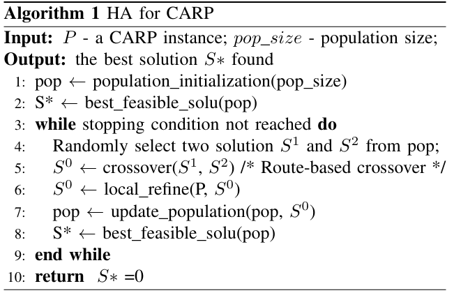
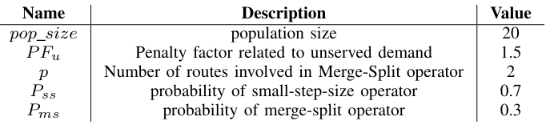
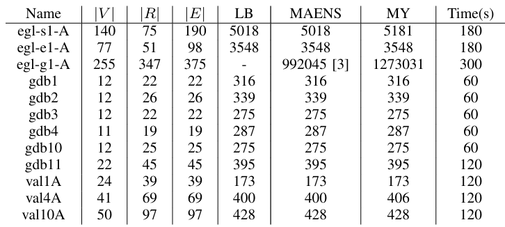

## Capacitated Arc Routing Problem

#### INTRODUCTION

The capacitated arc routing problem (CARP) is a difficult combinatorial optimization problem that has been intensively studied in the last decades. A heuristic algorithm based on tabu search and a local refine approach Merge-Split are applied and tested on various sets of benchmark instances. The computational results show that the proposed algorithm produces high-quality results within a reasonable computing time.

#### NOTATION AND SOLUTION REPRESENTATION

In a given graph $G(V, E)$, we have a number of required edges $ER$ to be served by a fleet of vehicles, each with a capacity $Q$, operating from a depot vertex $v_{d}$. Each task represents a required edge, and is characterized by its source, target, cost, and demand. Tasks are identified by unique IDs, and the problem solution involves sequencing these IDs, including dummy tasks as delimiters, to form routes for the vehicles.

Suppose a solution $S$ involves $m$ vehicle routes, $S$ can then be encoded as an order list of $(n+m+1)$ task IDs among which $(m+1)$ are dummy tasks: 
$$
S = \{S(1), S(2), ..., S(n+m+1)\}
$$
 where $S(i)$ denotes a task ID (an arc of the task or a dummy task) in the $i^{th}$ position of $S$. $S$ can also be written as a set of $m$ routes (one route per vehicle): 
$$
S = \{0, R_{1}, 0, R_{2}, 0, ..., 0, R_{m}, 0\}
$$
 where $R_i$ denotes the $i^{th}$ route composed of $|R_i|$ task IDs (arcs), i.e., 
$$
R_i = \{R_i(1), R_i(2), ..., R_i(|R_i|)\}
$$
 with $R_i(j)$ being the task ID at the $j^{th}$ position of $R_i$.

Let $sp(u, v)$ denotes the shortest path distance between the node $u$ and node $v$, the total cost of the solution S can be calculated as: 
$$
f(S)=\sum_{i=1}^{n+m}(cost(S(i))+dist(S(i), S(i+1)))
$$

#### A HEURISTIC ALGORITHM

##### A. main scheme

##### B. Population Initialization

In this procedure, we do not use the path-scanning or heuristic algorithm but randomly select an unserved task that does not violate the capacity constraint. If no task is satisfiable, complete the current route by following the shortest deadheading path to the depot vertex and start a new route. Otherwise, select one satisfactory task to extend the current route. This process continues until all tasks are served.

##### C. Route-based Crossover Operator *[3]*

Given two parent solutions $S^{1} = \{R^{1}_{1}, R^{1}_{2}, \dots, R^{1}_{m}\}$ and $S^{2} = \{R^{2}_{1}, R^{2}_{2}, \dots, R^{2}_{m}\}$, crossover copies $S^1$ to an offspring solution $S^0$ and replaces a route of $S^0$ with a route from $S^2$, and then repairs $S^0$ to establish feasibility if needed.

##### D. Population Updating

- Fitness Function
- Tabu Search

#### Local Refinement

- Single insertion(SI)
- Double insertion(DI)
- Merge-Split(MS) *[4]*

#### COMPUTATIONAL EXPERIMENTS

##### Parameters

#### REFERENCES

[1] Dror, M. Arc Routing: Theory, Solutions and Applications. Kluwer Academic Publishers 2000.

[2] Glover F., Kochenberger G. (Eds.). Handbook of Metaheuristics, Kluwer, Norwell, Massachusetts, USA. 2003.

[3] Chen, Yuning et al. “A hybrid metaheuristic approach for the capacitated arc routing problem.” Eur. J. Oper. Res. 253 (2016): 25-39.

[4] K. Tang, Y. Mei and X. Yao, "Memetic Algorithm With Extended Neighborhood Search for Capacitated Arc Routing Problems," in IEEE Transactions on Evolutionary Computation, vol. 13, no. 5, pp. 1151-1166, Oct. 2009, doi: 10.1109/TEVC.2009.2023449.

[5]  B. L. Golden, J. S. DeArmon, and E. K. Baker, “Computational experiments with algorithms for a class of routing problems,” Comput. Oper. Res., vol. 10, no. 1, pp. 47–59, 1983.

[6] Hertz, Alain & Laporte, Gilbert & Mittaz, Michel. (2000). A Tabu Search Heuristic for the Capacited Arc Routing Problem. Operations Research. 48. 10.1287/opre.48.1.129.12455. 