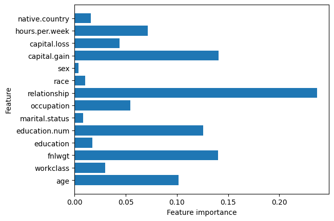

## Adult Census Income

### Introduction

This report details the use of machine learning to predict income levels using the "Census Income" dataset, focusing on developing and evaluating models to classify individuals by income based on demographic and socioeconomic factors for potential policy implications.

#### DATA PREPROCESSING

- Handling Missing Values
- Loading and Concatenating Data
- Handling Categorical Variables
- Feature Scaling

#### MODEL CLASSIFIERS

- KNeighborsClassifier
- LogisticRegression
- DecisionTreeClassifier
- GradientBoostingClassifier
- Multi-layer Perceptron classifier

#### MODEL EVALUATION

- Accuracy
- Precision
- Recall
- F1 Score
- Confusion Matrix

#### RESULT

##### KNeighborsClassifier

##### LogisticRegression

##### DecisionTreeClassifier

##### GradientBoostingClassifier

##### Multi-layer Perceptron classifier

